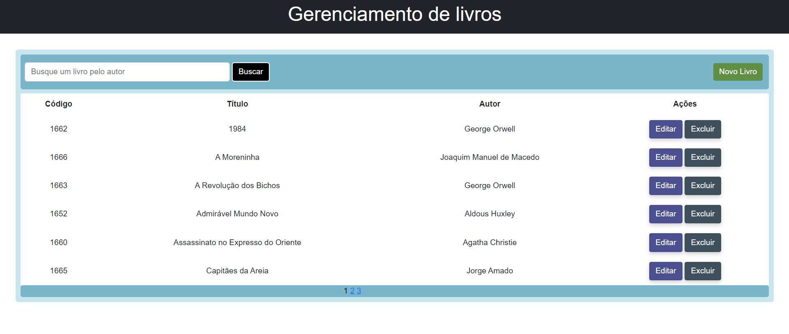

# Gerenciamento de Livros

  

    A tela inicial da aplicação possui, como elemento principal, uma tabela com a lista de todos os livros cadastrados, opções para cadastrar um novo livro, buscar livros pelo autor, assim como editar ou excluir um livro. A página foi feita de tal modo que só exibe 6 linhas da tabela.
  

  

    <h3>Tela inicial da aplicação.</h3>
    
   

   
 
        <h3>Formulário para cadastro de livro.</h3>
         
    

    
 
        <h3>Formulário para atualização de livro.</h3>
         
    

