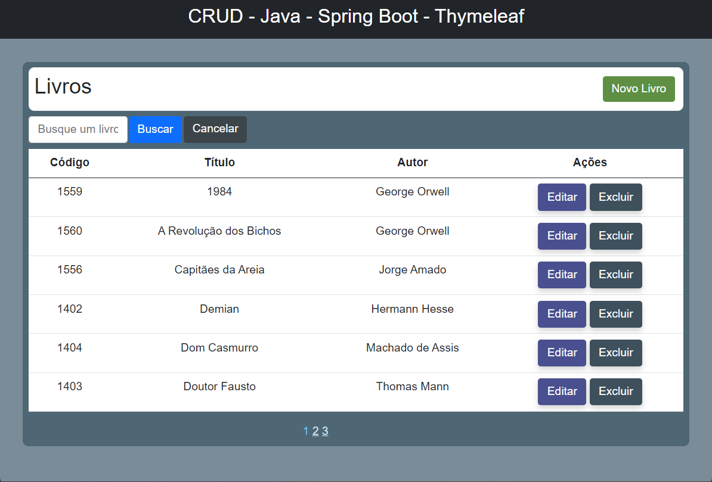
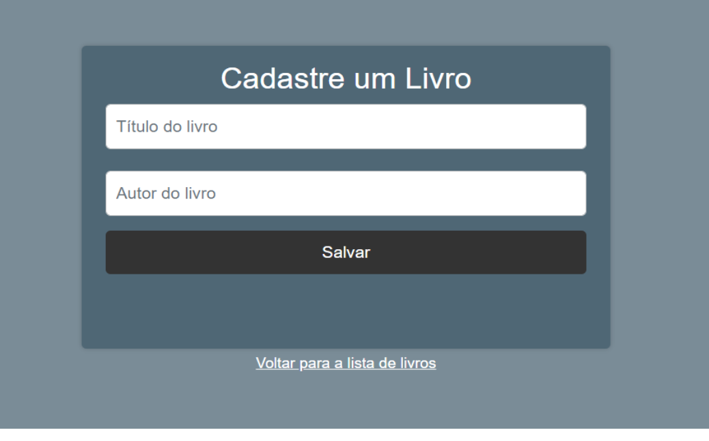

# Gerenciamento de Livros

  

    A tela principal da aplicação possui a uma tabela com a lista de todos livros cadastrados.

 
    <h1>A imagem a seguir ilustra a tela inicial.</h1>
    
   

   
 
        <h1>A imagem a seguir ilustra a tela de cadastro de livro.</h1>
         
    

    
 
        <h1>A imagem a seguir ilustra a tela de atualização de livro.</h1>
         
    

