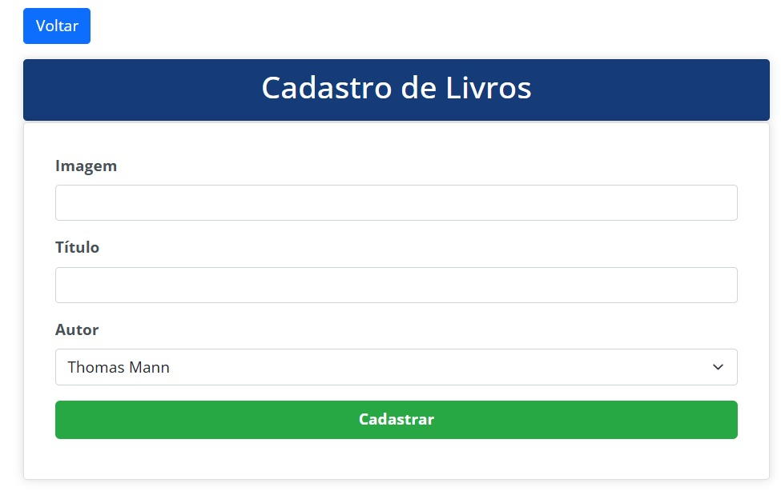

# Gerenciamento de Livros - Telas do Sistema

  

    <h3>Tela de login.</h3>
    
   

  

    <h3>Tela inicial do administrador.</h3>
    
   

   
 
        <h3>Tela de autores.</h3>
         
    

    
 
        <h3>Formulário para cadastrar autor.</h3>
         
    

    
 
        <h3>Formulário para editar autor.</h3>
         
    

    
 
        <h3>Tela de livros.</h3>
         
    

    
 
        <h3>Formulário para cadastrar livro.</h3>
         
    

    
 
        <h3>Formulário para editar livro.</h3>
         
    

    
 
        <h3>Detalhes do livro.</h3>
         
    

    
 
        <h3>Arquivo PDF dos detalhes do livro.</h3>
         
    

    
 
        <h3>Página de erro.</h3>
         
    

